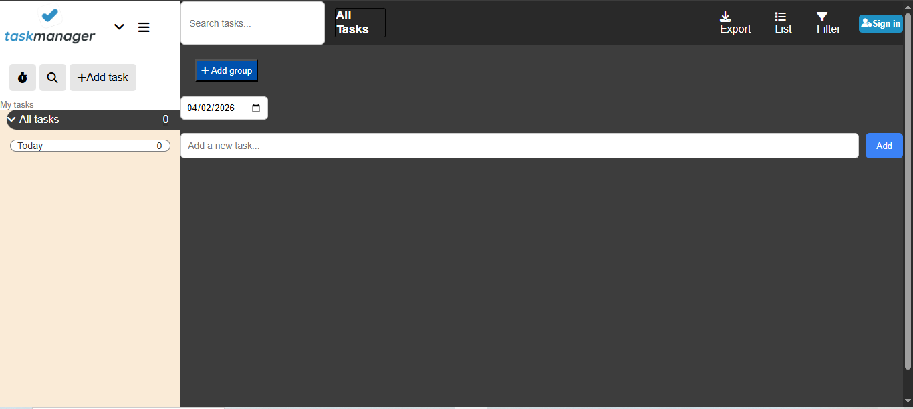

## 🔗 Live Demo

👉 https://Naimat-art.github.io/task-manager-app/

# task-manager-app
A simple and clean Task Manager built using **HTML, CSS, and JavaScript**.
This project helps users add, manage, and track their daily tasks efficiently.

---

## 🚀 Features

* ➕ Add new tasks
* ✅ Mark tasks as completed
* ❌ Delete tasks
* 📋 Dynamic UI updates
* 💡 Simple and user-friendly interface

---

## 🛠️ Technologies Used

* HTML
* CSS
* JavaScript (Vanilla JS)

---

## 📸 Screenshot



---

## 📂 Project Structure

```
task-manager-app/
│── images/
    └── screenshot.png
│── index.html
│── style.css
│── script.js
│── README.md
```

---

## ⚙️ How to Run

1. Download or clone the repository
2. Open `index.html` in your browser

---

## 🌱 Future Improvements

* Add local storage support
* Add edit task feature
* Add deadlines and reminders

---

## 🙌 Author

Developed by **Naimat Ali Khan**

---
